Cтудент группы БИВТ-25-8 Ищейкин Кирилл Алексеевич
# Лабораторные работы

## Лабораторная работа №1

---

- ###  1 задание
#### Код
```python
Name = input('Введите имя:')
Age = int(input('Введите возраст:'))
print(f'Привет, {Name}! Через год тебе будет {Age+1}.')
```
#### Вывод


---

- ### 2 задание
#### Код  
```python
a = input()
b = input()
a = float(a.replace(',', '.'))
b = float(b.replace(',', '.'))
avg = round((a + b)/ 2, 2)
sumi = a + b
print(sumi, avg, sep='; ')
```
#### Вывод


---

- ### 3 задание
#### Код
```python
price= int(input())
discount= int(input())
vat= int(input())
base = price * (1 - discount/100)
vat_amount = base * (vat/100)
total = base + vat_amount
print(f'База после скидки: {round(base, 2)} ₽')
print(f'НДС: {round(vat_amount, 2)} ₽')
print(f'Итого к оплате: {round(total, 2)} ₽')
```
#### Вывод


---

- ###  4 задание
#### Код  
```python
m = int(input())
h = m // 60
hm = m % 60
print(f'{h}:{hm:02d}')
```
#### Вывод


---

- ###  5 задание
#### Код  
```python
FCS = input()
initials = ''
len_FCS = len(FCS)
k = len_FCS - FCS.count(' ')
if FCS[0] != ' ':
	initials += FCS[0]
for i in range(1, len_FCS):
	if FCS[i] != ' ' and FCS[i-1] == ' ':
		initials += FCS[i]
print(initials)
print(k+2)
```
#### Вывод


---

- ###  6 задание
#### Код  
```python
N = int(input())
list_student = []
for i in range(N):
	student = input('')
	student = student.split()
	list_student.append(student)
koch = 0
kzaoch = 0
for i in range(N):
	if list_student[i][-1] == 'True':
		format = True
	else:
		format = False
	if format:
		koch += 1
	else:
		kzaoch += 1
print(koch, kzaoch)
```
#### Вывод


---

- ###  7 задание
#### Код  
```python
s = input()
len_s = len(s)
out_s = ''
num = '0123456789'
for i in range(len_s):
	if s[i].upper() == s[i]:
		first_ind = i
		break
for i in range(first_ind, len_s):
	if s[i] in num:
		second_ind = i + 1
		break
d = second_ind - first_ind
for i in range(first_ind, len_s, d):
	out_s += s[i]
print(out_s)
```
#### Вывод


---

## Лабораторная работа №2

---

- ###  задание A
#### Код
```python
def min_max(nums: list[float | int]) -> tuple[float | int, float | int]:
    if not nums:
        raise ValueError("Список пустой")
    maxi = max(nums)
    mini = min(nums)
    return mini, maxi

def unique_sorted(nums: list[float | int]) -> list[float | int]:
    list_sorted = sorted(set(nums))
    return list_sorted

def flatten(mat: list[list | tuple]) -> list:
    res = []
    for x in mat:
        if not isinstance(x, (list, tuple)):
            raise TypeError('строка не строка строк матрицы')
        for y in x:
            res.append(y)
    return res

example_list_1 = [-3.1, 2]
example_list_2 = [1.0, 1, 2.5, 2.5, 0]
example_list_3 = [[1], [], [2, 3]]

result_1 = min_max(example_list_1)
result_2 = unique_sorted(example_list_2)
result_3 = flatten(example_list_3)

print(f'Результат команды min_max: {result_1}')
print(f'Результат команды unique_sorted: {result_2}')
print(f'Результат команды flatten: {result_3}')
```
#### Вывод


---

- ###  задание B
#### Код
```python
def transpose(mat: list[list[float | int]]) -> list[list]:
    len_mat = len(mat)
    if len_mat == 0:
        return []
    len_row = len(mat[0])

    if any(len(row) != len_row for row in mat):
        raise ValueError("рваная матрица")
    
    new_mat = [ [ [] for y in range(len_mat) ] for x in range(len_row)]
    
    for i in range(len_mat):
        for j in range(len_row):
            new_mat[j][i] = mat[i][j]

    return new_mat

def row_sums(mat: list[list[float | int]]) -> list[float]:
    len_mat = len(mat)
    if len_mat == 0:
        return []
    len_row = len(mat[0])

    if any(len(row) != len_row for row in mat):
        raise ValueError("рваная матрица")    
    
    res = [sum(x) for x in mat]

    return res

def col_sums(mat: list[list[float | int]]) -> list[float]:
    len_mat = len(mat)
    if len_mat == 0:
        return []
    len_row = len(mat[0])
    
    if any(len(row) != len_row for row in mat):
        raise ValueError("рваная матрица")   
    
    res = [[] for x in range(len_row)]
    for i in range(len_mat):
       res[i] = sum([mat[j][i] for j in range(len_row)])
    return res

exmaple_mat_1 = [[1, 2], [3, 4]]
exmaple_mat_2 = [[1, 2, 3], [4, 5, 6]]
exmaple_mat_3 = [[-1, 1], [10, -10]]

result_1 = transpose(exmaple_mat_1)
result_2 = row_sums(exmaple_mat_2)
result_3 = col_sums(exmaple_mat_3)

print(f'Результат команды transpose: {result_1}')
print(f'Результат команды row_sums: {result_2}')
print(f'Результат команды col_sums: {result_3}')
```
#### Вывод


---

- ###  задание C
#### Код
```python
def fio_to_fcs(fio: str):
    fio = fio.strip()
    fcs = ''
    len_fio = len(fio)
    k = 0
    while fio[k] != ' ':
        fcs += fio[k]
        k += 1
    fcs = fcs.capitalize()
    fcs += ' '
    for i in range(k, len_fio):
        if fio[i] != ' ' and fio[i-1] == ' ':
            fcs += fio[i].upper() + '.'
    return fcs

def format_record(rec: tuple[str, str, float]) -> str:
    fio: str = rec[0]
    group: str = rec[1]
    gpa: float = rec[2]

    if len(fio) == 0 or all(x == ' ' for x in fio):
        raise ValueError('Пустое ФИО')
    if len(group) == 0 or all(x == ' ' for x in group):
        raise ValueError('Пустая группа')
    if not isinstance(gpa, float):
        raise TypeError('неверный тип GPA')
    
    fcs = fio_to_fcs(fio)
    group = f'гр. {group}'
    gpa = f'{gpa: .2f}'

    print(f'{fcs}, {group}, GPA {gpa}')

format_record( ("  сидорова  анна   сергеевна ", "ABB-01", 3.999) )
```
#### Вывод


---

## Лабораторная работа №3

---

- ###   задание A
#### Код
```python
import string
def normalize(text: str, *, casefold: bool = True, yo2e: bool = True) -> str:
    s = text
    if casefold:
        s = s.casefold()
    if yo2e:
        s = s.replace('ё', 'е').replace('Ё', 'Е')
    s = s.replace('\n', ' ').replace('\r', ' ').replace('\t', ' ')
    s = s.strip()
    while '  ' in s:
        s = s.replace('  ', ' ')
    return s

def tokenize(text: str) -> list[str]:
    s = text
    cyrillic_lower_letters = 'абвгдеёжзийклмнопрстуфхцчшщъыьэюя'
    alp = cyrillic_lower_letters + string.ascii_lowercase + string.digits
    for i in range(len(s)):
        if s[i] in alp:
            continue
        else:
            s = s[:i] + ' ' + s[i+1:]
    while '  ' in s:
        s = s.replace('  ', ' ')
    s = s.split()
    return s

def count_freq(tokens: list[str]) -> dict[str, int]:
    d = {}
    tokens_set = set(tokens)
    for key in tokens_set:
        d[key] = tokens.count(key)
    return d

def top_n(freq: dict[str, int], n: int = 5) -> list[tuple[str, int]]:
    d = freq
    d = sorted(d.items(), key = lambda para: (-para[1], para[0]))
    return d


example_normalize = "  двойные   пробелы  "
example_tokenize = "emoji 😀 не слово"
example_count_freq = ["bb","aa","bb","aa","cc"]

res_normalise = normalize(example_normalize)
res_tokenize = tokenize(example_tokenize)
res_count_freq = count_freq(example_count_freq)
res_count_top_n = top_n(res_count_freq)

print(res_normalise)    
print(res_tokenize)
print(res_count_freq)
print(res_count_top_n)
```
#### Вывод


---

- ###   задание B
#### Код
```python
from text import normalize, tokenize, count_freq, top_n

def script():
    text = input()
    # Получаем список всех слов
    text_corrected = tokenize(normalize(text))
    # Считаем общее кол-во слов
    count_words = len(text_corrected)
    # Получаем словарь уникальных слов
    dict_words = count_freq(text_corrected)
    # Считаем кол-во уникальных слов
    count_words_unique = len(dict_words)
    # Сортируем словарь по кол-ву слов
    dict_words_sort = top_n(dict_words)


    print(f'Всего слов: {count_words}')
    print(f'Уникальных слов: {count_words_unique}')
    print()
    print('Топ 5:')
    k = 0
    print(f'{"слово:":^15} |{"частота":^15}')
    print(f"{'----------'*3:^30}")
    for word, counts in dict_words_sort:
        if k == 5:
            break
        k += 1
        print(f'{word:^15} |{counts:^15}')

script()
```
#### Вывод


---

## Лабораторная работа №4

---

- ###   задание A
#### Код
```python

import csv
from pathlib import Path
def read_text(path: str | Path, encoding: str = "utf-8") -> str:
    with open(path, 'r', encoding=encoding) as f:
        return f.read()

def write_csv(rows: list[tuple | list], path: str | Path, header: tuple[str, ...] | None = None) -> None:
    if rows and len(set(len(row) for row in rows)) != 1:
        raise ValueError("Все строки должны иметь одинаковую длину")
    
    with open(path, 'w', newline='', encoding='utf-8') as f:
        writer = csv.writer(f)
        if header:
            writer.writerow(header)
        writer.writerows(rows)

if __name__ == "__main__":
    try:
        txt = read_text('src\lab04\Text.txt')
        print(f"Прочитано: {txt}")
    except FileNotFoundError:
        print("Файл text.txt не найден")
    
    write_csv([("word", "count"), ("test", 3)], "table.csv")  
    print("файл csv создан!")

```
#### Вывод


---

- ###   задание B
#### Код
```python

import sys, os, csv
from collections import Counter

sys.path.insert(0, os.path.join(os.path.dirname(__file__), '..', '..'))

try:
    from src.lab03.text import normalize, tokenize
except ImportError as e:
    sys.exit(f"Ошибка импорта: {e}")

def main():
    input_file = 'src\lab04\Text.txt'
    output_file = 'src\lab04\Table.csv'

    try:
        with open(input_file, 'r', encoding='utf-8') as f:
            text = f.read()
        if not text.strip():
            sys.exit("Файл пустой")
    except Exception as e:
        sys.exit(f"Ошибка чтения {input_file}: {e}")
    
    try:
        normalized = normalize(text)
        words = tokenize(normalized)
        if not words:
            sys.exit("После обработки слов не найдено")
        word_freq = Counter(words)
    except Exception as e:
        sys.exit(f"Ошибка обработки текста: {e}")


    try:
        os.makedirs(os.path.dirname(output_file), exist_ok=True)
        with open(output_file, 'w', encoding='utf-8', newline='') as f:
            writer = csv.writer(f)
            writer.writerow(['word', 'count'])
            for word, count in sorted(word_freq.items(), key=lambda x: (-x[1], x[0])):
                writer.writerow([word, count])
    except Exception as e:
        sys.exit(f"Ошибка сохранения {output_file}: {e}")
    
    top5 = sorted(word_freq.items(), key=lambda x: (-x[1], x[0]))[:5]
    print(f"Всего слов: {len(words)}")
    print(f"Уникальных слов: {len(word_freq)}")
    print('Топ 5:')
    k = 0
    print(f'{"слово:":^15} |{"частота":^15}')
    print(f"{'----------'*3:^30}")
    for word, counts in top5:
        if k == 5:
            break
        k += 1
        print(f'{word:^15} |{counts:^15}')

if __name__ == "__main__":
    main()

```
#### Вывод


---

## Лабораторная работа №5

---

- ###   задание A
#### Код
```python
import csv, json, os, sys
from pathlib import Path

sys.path.append(os.path.join(os.path.dirname(__file__), '..'))

from lib.func1 import is_file_empty
from lib.text import ensure_directory_exists
def json_to_csv(json_path: str, csv_path: str) -> None:
	# Проверка json файла
	json_file = Path(json_path)
	if not json_file.exists():
		raise FileNotFoundError(f'JSON файл не найден: {json_path}')
	
	if json_file.suffix.lower() != '.json':
		raise TypeError(f'Файл должен быть в формате json')
	
	if is_file_empty(json_path):
		raise FileNotFoundError(f'Файл {json_path} пустой')
	
	ensure_directory_exists(csv_path)
	# Проверка csv файла
	try:
		csv_file = Path(csv_path)
	except:
		raise FileNotFoundError(f'csv файл не найден: {csv_path}')
	if csv_file.suffix.lower() != '.csv':
		raise TypeError(f'Файл должен быть в формате csv')
	
	try:
		with open(json_path, 'r' ,encoding='utf-8') as json_file:
			data = json.load(json_file)
	except json.JSONDecodeError as e:
		raise ValueError(f'Ошибка парсинга JSON: {e}')
	
	# Проверяем, что json состоит из списков
	if not isinstance(data, list):
		raise ValueError("JSON должен содержать список объектов")
	
	# Проверяем структуры данных
	if not all(isinstance(item, dict) for item in data):
		raise ValueError("Все элементы в JSON должны быть словарями")
	
	fieldnames = set()
	for item in data:
		fieldnames.update(item.keys())
	
	try:
		with open(csv_path, 'w' ,encoding='utf-8', newline='') as csv_file:
			writer = csv.DictWriter(csv_file, fieldnames=fieldnames)

			writer.writeheader()

			for item in data:
				row = {key: item.get(key, '') for key in fieldnames}
				writer.writerow(row)
	except Exception as e:
		raise ValueError(f"Ошибка записи CSV: {e}")


def csv_to_json(csv_path: str, json_path: str) -> None:
    csv_file = Path(csv_path)
    ensure_directory_exists(json_path)
    json_file = Path(json_path)
    
    try:
        data = []     
        with open(csv_file, 'r', encoding='utf-8') as f:
			# Проверяем заголовки 
            sample = f.read(1024)
            f.seek(0)
            sniffer = csv.Sniffer()
            try:            
                has_header = sniffer.has_header(sample)
            except csv.Error:
                has_header = True           
            if not has_header:
                raise ValueError("CSV файл, вероятно, не содержит заголовок (эвристический подход)")	
			
            # Пытаемся прочитать CSV с заголовками
            csv_reader = csv.DictReader(f)
            
            # Проверяем, есть ли поле fieldnames (заголовки)
            if csv_reader.fieldnames is None:
                raise ValueError("CSV файл не содержит заголовков!")
            # Проверяем, что все заголовки уникальны
            if len(csv_reader.fieldnames) != len(set(csv_reader.fieldnames)):
                raise ValueError("Заголовки CSV содержат дубликаты!")
            
            # Читаем данные
            for row in csv_reader:
                data.append(row)
        
        # Сохраняем JSON
        with open(json_file, 'w', encoding='utf-8') as f:
            json.dump(data, f, indent=4, ensure_ascii=False)
        
    except Exception as e:
        print(f"Ошибка: {e}")

try:
	json_to_csv("data/samples/empty_json.json", "data/out/empty_json.csv")
	csv_to_json("data/samples/no_header_csv.csv", "data/out/no_header_csv.json")
	json_to_csv("data/samples/test_missing_fields.json", "data/out/missing_fields_from_json.csv")
	json_to_csv("data/samples/people.json", "data/out/people_from_json.csv")
	csv_to_json("data/samples/people.csv", "data/out/people_from_csv.json")
except Exception as e:
     print(f"Ошибка: {e}")

```
#### Вывод
пустый json

csv без заголовков не создает json файл

people csv -> json

people json -> csv

пустые ячейки

---

- ###   задание B
#### Код
```python
import openpyxl, os, sys, csv
from pathlib import Path
from openpyxl.utils import get_column_letter

sys.path.append(os.path.join(os.path.dirname(__file__), '..'))
from lib.func1 import is_file_empty

def csv_to_xlsx(csv_path: str, xlsx_path: str) -> None:
    """
    Конвертирует CSV в XLSX.
    Использовать openpyxl ИЛИ xlsxwriter.
    Первая строка CSV — заголовок.
    Лист называется "Sheet1".
    Колонки — автоширина по длине текста (не менее 8 символов).
    """
    # Добавляем путь csv и xlsx файла
    csv_file = Path(csv_path)
    xlsx_file = Path(xlsx_path)
    
    # Проверяем существует ли файл
    if not csv_file.exists():
        raise FileNotFoundError(f'Файл {csv_path} не найден')
    
    # Проверяем пустой файл или нет
    if is_file_empty(csv_file):
        raise ValueError(f'Файл {csv_path} пустой')
    
    # Проверяем формат файлов
    if csv_file.suffix.lower() != '.csv':
        raise TypeError(f'файл {csv_path} не формата csv')

    # Создаем директорию для XLSX файла если её нет
    xlsx_file.parent.mkdir(parents=True, exist_ok=True)

    # Читаем CSV и конвертируем в XLSX
    try:
        # Создаем новую книгу Excel
        workbook = openpyxl.Workbook()
        worksheet = workbook.active
        worksheet.title = "Sheet1"

        with open(csv_file, 'r', encoding='utf-8', newline='') as file:
            csv_reader = csv.reader(file)

            # При помощи циклов записываем данные в xlsx
            for row_idx, row in enumerate(csv_reader, 1):
                for col_idx, value in enumerate(row, 1):
                    worksheet.cell(row=row_idx, column=col_idx, value=value)

        # Задаем ширину колонок
        for column in worksheet.columns:
            max_length = 0
            column_letter = get_column_letter(column[0].column) 
            
            for cell in column:
                if cell.value:  # Проверяем что значение не None
                    cell_length = len(str(cell.value))
                    if cell_length > max_length:
                        max_length = cell_length
            
            # Устанавливаем ширину колонки (не менее 8 символов)
            column_width = max(max_length + 2, 8)
            worksheet.column_dimensions[column_letter].width = column_width

        # Сохраняем файл
        workbook.save(xlsx_file)
        print(f"Успешно создан XLSX файл: {xlsx_path}")
        
    except Exception as e:
        raise ValueError(f'Не получилось считать CSV файл: {e}')

try:
    csv_to_xlsx("data/samples/people.csv", "data/out/people.xlsx")
    csv_to_xlsx("data/samples/cities.csv", "data/out/cities.xlsx")  
except Exception as e:
    print(f"Ошибка: {e}")
```
#### Вывод
cities.xlsx

people.xlsx


---

---

## Лабораторная работа №6

---

- ###   задание A
#### Код
```python
import argparse
import sys
import os
from pathlib import Path

sys.path.insert(0, os.path.join(os.path.dirname(__file__), '..'))
from lib.text import table_output 

def stats(input_file: str, top: int = 5):
    try:
        with open(input_file, 'r', encoding='utf-8') as file:
            text = file.read()
    
        table_output(text, top) 
             
    except FileNotFoundError:
        print(f"Ошибка: Файл '{input_file}' не найден")
    except Exception as e:
        print(f"Ошибка при обработке файла: {e}")

# остальной код без изменений...
def cat(input_file: str, number_lines: bool = False):
    try:
        with open(input_file, 'r', encoding='utf-8') as file:
            lines = file.readlines()
        
        for i, line in enumerate(lines, 1):
            if number_lines:
                print(f"{i:6d}  {line}", end='')
            else:
                print(line, end='')
                
    except FileNotFoundError:
        print(f"Ошибка: Файл '{input_file}' не найден")
    except Exception as e:
        print(f"Ошибка при чтении файла: {e}")

def main():
    parser = argparse.ArgumentParser(description="CLI утилиты")
    subparsers = parser.add_subparsers(dest="command")

    cat_parser = subparsers.add_parser("cat", help="Вывести содержимое файла")
    cat_parser.add_argument("--input", required=True, help="Путь к файлу")
    cat_parser.add_argument("-n", action="store_true", help="Нумеровать строки")

    stats_parser = subparsers.add_parser("stats", help="Частоты слов")
    stats_parser.add_argument("--input", required=True, help="Путь к файлу")
    stats_parser.add_argument("--top", type=int, default=5, help="Количество топ-слов")

    args = parser.parse_args()

    if not args.command:
        parser.print_help()
        return

    if args.command == "stats":
        stats(args.input, args.top)
    elif args.command == "cat":
        cat(args.input, args.n) 

if __name__ == "__main__":
    main()
```
#### Вывод
help_cli_text
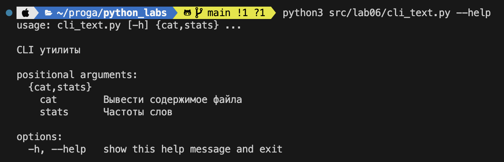
help_cat
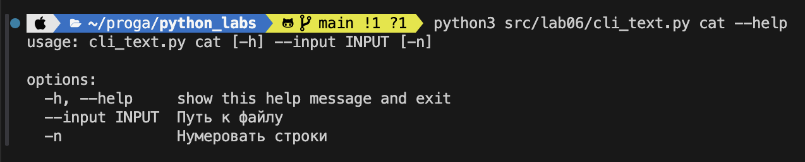
help_stats
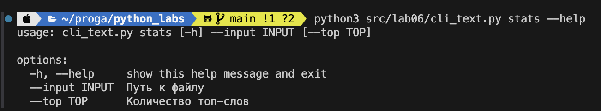

---

- ###   задание B
#### Код
```python
import argparse
import sys
import os

sys.path.append(os.path.join(os.path.dirname(__file__), '..'))

from lib.text import json_to_csv, csv_to_json, csv_to_xlsx

def main():
    parser = argparse.ArgumentParser(description="Конвертер данных между форматами")
    subparsers = parser.add_subparsers(dest="command")

    json_to_csv_parser = subparsers.add_parser("json2csv", help="Конвертировать JSON в CSV")
    json_to_csv_parser.add_argument("--in", dest="input_file", required=True, help="Входной JSON файл")
    json_to_csv_parser.add_argument("--out", dest="output_file", required=True, help="Выходной CSV файл")

    csv_to_json_parser = subparsers.add_parser("csv2json", help="Конвертировать CSV в JSON")
    csv_to_json_parser.add_argument("--in", dest="input_file", required=True, help="Входной CSV файл")
    csv_to_json_parser.add_argument("--out", dest="output_file", required=True, help="Выходной JSON файл")

    csv_to_xlsx_parser = subparsers.add_parser("csv2xlsx", help="Конвертировать CSV в XLSX")
    csv_to_xlsx_parser.add_argument("--in", dest="input_file", required=True, help="Входной CSV файл")
    csv_to_xlsx_parser.add_argument("--out", dest="output_file", required=True, help="Выходной XLSX файл")

    args = parser.parse_args()

    if not args.command:
        parser.print_help()
        return

    try:
        if args.command == "json2csv":
            json_to_csv(args.input_file, args.output_file)
            print(f"✅ Успешно: {args.input_file} → {args.output_file}")
        elif args.command == "csv2json":
            csv_to_json(args.input_file, args.output_file)
            print(f"✅ Успешно: {args.input_file} → {args.output_file}")
        elif args.command == "csv2xlsx":
            csv_to_xlsx(args.input_file, args.output_file)
            print(f"✅ Успешно: {args.input_file} → {args.output_file}")
    except FileNotFoundError:
        print(f"Ошибка: файл не найден")
    except Exception as e:
        print(f"шибка конвертации: {e}")

if __name__ == "__main__":
    main()
```
#### Вывод
help_cli_convert
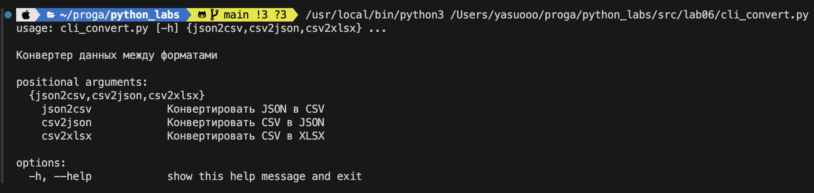
help_csv2json
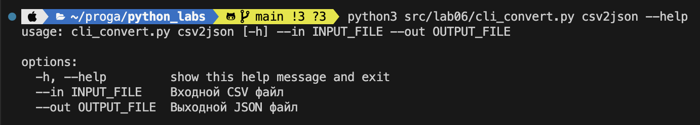
help_csv2xlsx
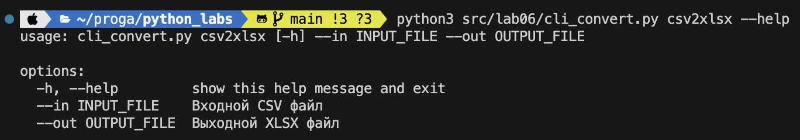
help_json2csv
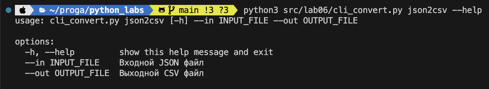

---

---

## Лабораторная работа №7

---

- ###   Автотесты

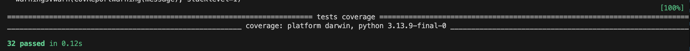

---

- ###   Покрытие

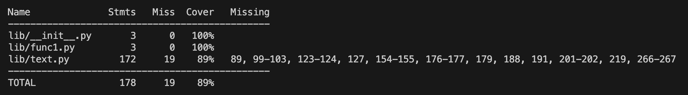

---

- ###   Black

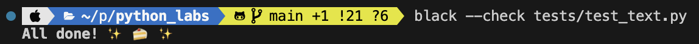

---

---

## Лабораторная работа 8 
### Класс Students 
| Поле       | Тип   | Описание |
|------------|-------| ----------- |
| fio        | str   | Фамилия и инициалы студента (формат: Фамилия И.О.) |
| birthdate  | str   | Дата рождения в формате YYYY/MM/DD  |
| group      | str   | Название учебной группы |
| gpa        | float | Средний балл (от 0.0 до 5.0)  |
### models.py
#### __post_init__
Проверки:
### ФИО (fio):
   - Должен быть строкой.
   - Не может быть пустым

### Дата рождения (birthdate):
   - Должна соответствовать формату %Y/%m/%d (например, 2000/01/20).
   - Не может быть пустым

### Группа (group):
   - Не может быть пустой строкой или состоять только из пробелов.
   - Не может быть пустым

### Средний балл (gpa):
   - Должен быть типом float.
   - Должен находиться в диапазоне от 0.0 до 5.0 включительно.

#### Методы класса
### age 
   - Сравнивает текущую дату с датой рождения. Если день рождения в текущем году еще не наступил, вычитает 1 год из разницы лет.
### to_dict 
   - Сериализует объект студента в словарь
### from_dict
   - Классовый метод (Class Method) Создает экземпляр класса Student из словаря.
### __str__ 
   - Возвращает строковое представление объекта в формате: Student (Фамилия И.О., YYYY/MM/DD, Группа, GPA)
#### Примеры запуска

### serialize.py
#### students_to_json(students, path)
- Принимает список объектов Student, конвертирует их в словари и записывает в JSON-файл.
#### students_from_json(path) 
- Читает JSON-файл, валидирует структуру и возвращает список объектов Student. 
## Примеры запуска
### models.py
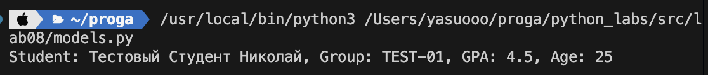
### serialize.py
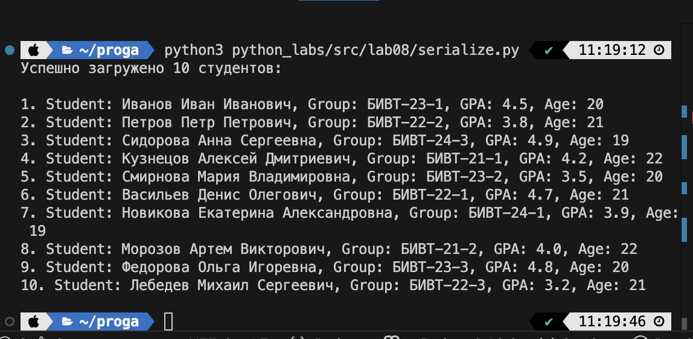
#### Входящий файл 
```json
{
  {
    "fio": "Иванов Иван Иванович",
    "birthdate": "2005-05-15",
    "group": "БИВТ-23-1",
    "gpa": 4.5
  },
  {
    "fio": "Петров Петр Петрович",
    "birthdate": "2004-12-01",
    "group": "БИВТ-22-2",
    "gpa": 3.8
  },
  {
    "fio": "Сидорова Анна Сергеевна",
    "birthdate": "2006-07-23",
    "group": "БИВТ-24-3",
    "gpa": 4.9
  },
  {
    "fio": "Кузнецов Алексей Дмитриевич",
    "birthdate": "2003-11-30",
    "group": "БИВТ-21-1",
    "gpa": 4.2
  },
  {
    "fio": "Смирнова Мария Владимировна",
    "birthdate": "2005-02-14",
    "group": "БИВТ-23-2",
    "gpa": 3.5
  },
  {
    "fio": "Васильев Денис Олегович",
    "birthdate": "2004-08-08",
    "group": "БИВТ-22-1",
    "gpa": 4.7
  },
  {
    "fio": "Новикова Екатерина Александровна",
    "birthdate": "2006-01-20",
    "group": "БИВТ-24-1",
    "gpa": 3.9
  },
  {
    "fio": "Морозов Артем Викторович",
    "birthdate": "2003-03-25",
    "group": "БИВТ-21-2",
    "gpa": 4.0
  },
  {
    "fio": "Федорова Ольга Игоревна",
    "birthdate": "2005-09-10",
    "group": "БИВТ-23-3",
    "gpa": 4.8
  },
  {
    "fio": "Лебедев Михаил Сергеевич",
    "birthdate": "2004-06-05",
    "group": "БИВТ-22-3",
    "gpa": 3.2
  }
}
```     


#### Исходящий файл
```python
[
  {
    "fio": "Иванов Иван Иванович",
    "birthdate": "2005-05-15",
    "group": "БИВТ-23-1",
    "gpa": 4.5
  },
  {
    "fio": "Петров Петр Петрович",
    "birthdate": "2004-12-01",
    "group": "БИВТ-22-2",
    "gpa": 3.8
  },
  {
    "fio": "Сидорова Анна Сергеевна",
    "birthdate": "2006-07-23",
    "group": "БИВТ-24-3",
    "gpa": 4.9
  },
  {
    "fio": "Кузнецов Алексей Дмитриевич",
    "birthdate": "2003-11-30",
    "group": "БИВТ-21-1",
    "gpa": 4.2
  },
  {
    "fio": "Смирнова Мария Владимировна",
    "birthdate": "2005-02-14",
    "group": "БИВТ-23-2",
    "gpa": 3.5
  },
  {
    "fio": "Васильев Денис Олегович",
    "birthdate": "2004-08-08",
    "group": "БИВТ-22-1",
    "gpa": 4.7
  },
  {
    "fio": "Новикова Екатерина Александровна",
    "birthdate": "2006-01-20",
    "group": "БИВТ-24-1",
    "gpa": 3.9
  },
  {
    "fio": "Морозов Артем Викторович",
    "birthdate": "2003-03-25",
    "group": "БИВТ-21-2",
    "gpa": 4.0
  },
  {
    "fio": "Федорова Ольга Игоревна",
    "birthdate": "2005-09-10",
    "group": "БИВТ-23-3",
    "gpa": 4.8
  },
  {
    "fio": "Лебедев Михаил Сергеевич",
    "birthdate": "2004-06-05",
    "group": "БИВТ-22-3",
    "gpa": 3.2
  }
]
```   

---

---

## Лабораторная работа 9

---

### Пример команды list
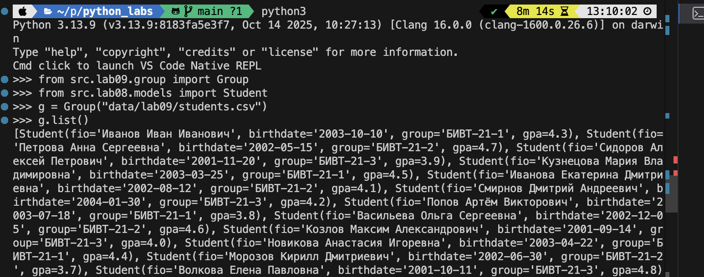
### Пример команды add
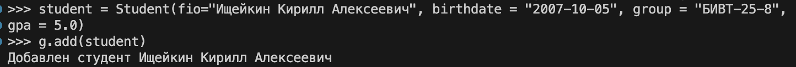
---
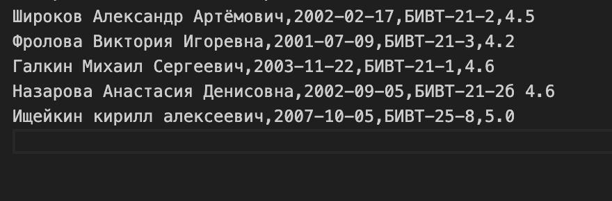
### Пример команды find
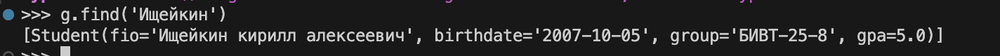
### Пример команды update
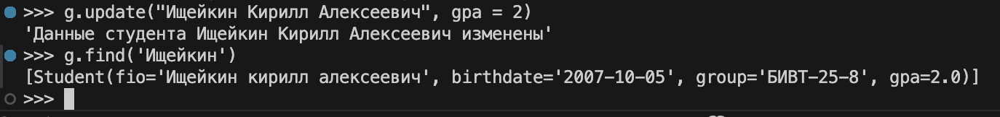
### Пример команды remove
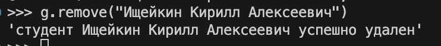
---
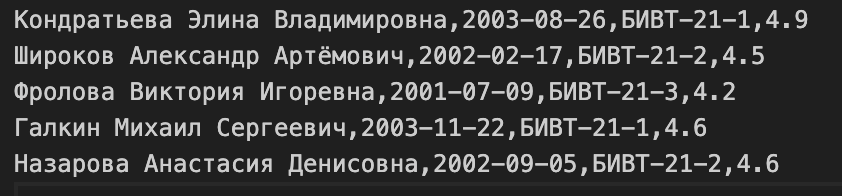
### Пример команды stats
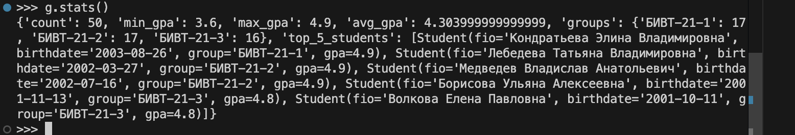
### Пример красивого оформления
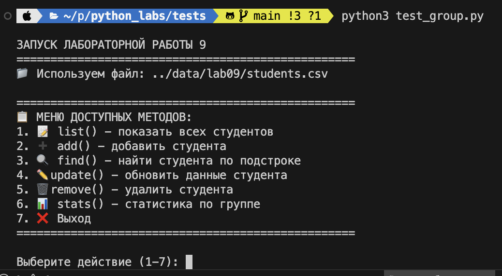
### Пример команды 1

### Пример команды 6
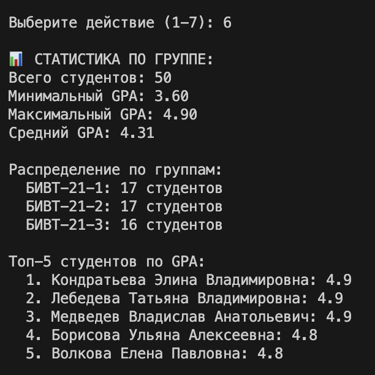

### Код __init__.py
```python
from .group import Group

__all__ = ['Group']
```

### Код group.py
```python
from __future__ import annotations
import csv
from src.lab08.models import Student
from pathlib import Path

class Group:
    def __init__(self, storage_path: str):
        self.path = Path(storage_path)
        self._ensure_storage_exists()
        
    def _ensure_storage_exists(self):
        """Создаёт CSV-файл с заголовками, если его нет"""
        if not self.path.exists():
            # Создаём папки если их нет
            self.path.parent.mkdir(parents=True, exist_ok=True)
            
            # Создаём файл и пишем заголовок
            with open(self.path, 'w', encoding='utf-8', newline='') as file:
                writer = csv.writer(file)
                writer.writerow(["fio", "birthdate", "group", "gpa"])

    def add(self, student: Student):
        with open(self.path, 'a', newline='', encoding='utf-8') as file:
            writer = csv.writer(file)

            row_data = [
                student.fio.title(),
                student.birthdate,
                student.group,
                str(student.gpa)
            ]
            writer.writerow(row_data)

            print(f"Добавлен студент {student.fio}")

    def list(self):
        return self._read_all()

    def _read_all(self):
        """Вернёт список объектов Student"""
        if not self.path.exists():
            return []
        
        students = []
        with open(self.path, 'r', encoding='utf-8', newline='') as file:
            reader = csv.DictReader(file)  

            for row_dict in reader:  
                student = Student.from_dict(row_dict)  
                students.append(student)

        return students
    
    def _write_all(self, students: list[Student]):
        with open(self.path, 'w', newline='', encoding='utf-8') as file:
            writer = csv.writer(file)
            writer.writerow(["fio", "birthdate", "group", "gpa"])

            for student in students:
                row_data = [
                    student.fio,
                    student.birthdate,
                    student.group,
                    str(student.gpa)
                ]

                writer.writerow(row_data)
    
    def find(self, substr: str):
        students = self._read_all()
        found_students = []
        for student in students:
            if substr.lower() in student.fio.lower():
                found_students.append(student)
        if len(found_students) == 0:
            return f"Студент {substr} не найден"
        return found_students
    
    def remove(self, fio: str):
        students = self._read_all()
        all_students = []
        for student in students:
            if student.fio.lower() != fio.lower():
                all_students.append(student)

        kb = len(students)
        ka = len(all_students)
        if kb != ka:
            self._write_all(all_students)
            return f'студент {fio} успешно удален'
        else:
            return f'Cтудент {fio} не найден'
        
    def update(self, fio: str, **fields):
        students = self._read_all()
        field_fio = fields.get('fio')
        field_birthdate = fields.get('birthdate')
        field_group = fields.get('group')
        field_gpa = fields.get('gpa')
        all_students = []
        student_found = False
        for student in students:
            if student.fio.lower() != fio.lower():
                all_students.append(student)
            else:
                student_found = True
                if field_fio is not None:
                    student.fio = field_fio
                if field_birthdate is not None:
                    student.birthdate = field_birthdate
                if field_group is not None:
                    student.group = field_group
                if field_gpa is not None:
                    student.gpa = field_gpa
                all_students.append(student)
        if not student_found: return f'Студент {fio} не найден'
        self._write_all(all_students)
        return f'Данные студента {fio} изменены'
    
    def stats(self) -> dict:
        students = self._read_all()
        count_students = len(students)
        min_gpa = 5.0
        max_gpa = 0.0
        sum_gpa = 0
        csig = {} # count_students_in_group
        students = sorted(students, key = lambda student: (-student.gpa, student.fio))

        top_5_students = []
        k = 0
        for student in students:
            k += 1
            if k <= 5: top_5_students.append(student)

            t_gpa = float(student.gpa)
            sum_gpa += t_gpa
            if t_gpa > max_gpa:
                max_gpa = t_gpa
            if t_gpa < min_gpa:
                min_gpa = t_gpa
            
            t_group = student.group
            if t_group not in csig:
                csig[t_group] = 1
            else:
                csig[t_group] += 1
            
        avg_gpa = sum_gpa / count_students

        d = {
            "count": count_students,
            "min_gpa": min_gpa,
            "max_gpa": max_gpa,
            "avg_gpa": avg_gpa,
            "groups": csig,
            "top_5_students": top_5_students
        }
        
        return d
```