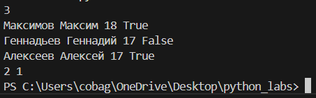

Cтудент группы БИВТ-25-8 Ищейкин Кирилл Алексеевич
# Лабараторные работы

## Лабараторная работа №1

---

- ###  1 задание
#### Код
```python
Name = input('Введите имя:')
Age = int(input('Введите возраст:'))
print(f'Привет, {Name}! Через год тебе будет {Age+1}.')
```
#### Вывод


---

- ### 2 задание
#### Код  
```python
a = int(input())
b = int(input())
sum = a + b
avg = round((a + b)/ 2, 2)
print(sum, avg, sep='; ')
```
#### Вывод


---

- ### 3 задание
#### Код
```python
price= int(input())
discount= int(input())
vat= int(input())
base = price * (1 - discount/100)
vat_amount = base * (vat/100)
total = base + vat_amount
print(f'База после скидки: {round(base, 2)} ₽')
print(f'НДС: {round(vat_amount, 2)} ₽')
print(f'Итого к оплате: {round(total, 2)} ₽')
```
#### Вывод


---

- ###  4 задание
#### Код  
```python
m = int(input())
h = m // 60
hm = m % 60
print(f'{h}:{hm}')
```
#### Вывод


---

- ###  5 задание
#### Код  
```python
FCS = input()
initials = ''
len_FCS = len(FCS)
k = len_FCS - FCS.count(' ')
if FCS[0] != ' ':
	initials += FCS[0]
for i in range(1, len_FCS):
	if FCS[i] != ' ' and FCS[i-1] == ' ':
		initials += FCS[i]
print(initials)
print(k)
```
#### Вывод


---

- ###  6 задание
#### Код  
```python
N = int(input())
list_student = []
for i in range(N):
	student = input('')
	student = student.split()
	list_student.append(student)
koch = 0
kzaoch = 0
for i in range(N):
	if list_student[i][-1] == 'True':
		format = True
	else:
		format = False
	if format:
		koch += 1
	else:
		kzaoch += 1
print(koch, kzaoch)
```
#### Вывод


---

- ###  7 задание
#### Код  
```python
s = input()
len_s = len(s)
out_s = ''
num = '0123456789'
for i in range(len_s):
	if s[i].upper() == s[i]:
		first_ind = i
		break
for i in range(first_ind, len_s):
	if s[i] in num:
		second_ind = i + 1
		break
d = second_ind - first_ind
for i in range(first_ind, len_s, d):
	out_s += s[i]
print(out_s)
```
#### Вывод


---

## Лабараторная работа №2

---

- ###  1 задание
#### Код
```python
def min_max(nums: list[float | int]) -> tuple[float | int, float | int]:
    if not nums:
        raise ValueError("Список пустой")
    maxi = max(nums)
    mini = min(nums)
    return mini, maxi

def unique_sorted(nums: list[float | int]) -> list[float | int]:
    list_sorted = sorted(set(nums))
    return list_sorted

def flatten(mat: list[list | tuple]) -> list:
    res = []
    for x in mat:
        if not isinstance(x, (list, tuple)):
            raise TypeError('строка не строка строк матрицы')
        for y in x:
            res.append(y)
    return res

example_list_1 = [-3.1, 2]
example_list_2 = [1.0, 1, 2.5, 2.5, 0]
example_list_3 = [[1], [], [2, 3]]

result_1 = min_max(example_list_1)
result_2 = unique_sorted(example_list_2)
result_3 = flatten(example_list_3)

print(f'Результат команды min_max: {result_1}')
print(f'Результат команды unique_sorted: {result_2}')
print(f'Результат команды flatten: {result_3}')
```
#### Вывод


---

- ###  2 задание
#### Код
```python
def transpose(mat: list[list[float | int]]) -> list[list]:
    len_mat = len(mat)
    if len_mat == 0:
        return []
    len_row = len(mat[0])

    if any(len(row) != len_row for row in mat):
        raise ValueError("рваная матрица")
    
    new_mat = [ [ [] for y in range(len_mat) ] for x in range(len_row)]
    
    for i in range(len_mat):
        for j in range(len_row):
            new_mat[j][i] = mat[i][j]

    return new_mat

def row_sums(mat: list[list[float | int]]) -> list[float]:
    len_mat = len(mat)
    if len_mat == 0:
        return []
    len_row = len(mat[0])

    if any(len(row) != len_row for row in mat):
        raise ValueError("рваная матрица")    
    
    res = [sum(x) for x in mat]

    return res

def col_sums(mat: list[list[float | int]]) -> list[float]:
    len_mat = len(mat)
    if len_mat == 0:
        return []
    len_row = len(mat[0])
    
    if any(len(row) != len_row for row in mat):
        raise ValueError("рваная матрица")   
    
    res = [[] for x in range(len_row)]
    for i in range(len_mat):
       res[i] = sum([mat[j][i] for j in range(len_row)])
    return res

exmaple_mat_1 = [[1, 2], [3, 4]]
exmaple_mat_2 = [[1, 2, 3], [4, 5, 6]]
exmaple_mat_3 = [[-1, 1], [10, -10]]

result_1 = transpose(exmaple_mat_1)
result_2 = row_sums(exmaple_mat_2)
result_3 = col_sums(exmaple_mat_3)

print(f'Результат команды transpose: {result_1}')
print(f'Результат команды row_sums: {result_2}')
print(f'Результат команды col_sums: {result_3}')
```
#### Вывод


---

- ###  3 задание
#### Код
```python
def fio_to_fcs(fio: str):
    fio = fio.strip()
    fcs = ''
    len_fio = len(fio)
    k = 0
    while fio[k] != ' ':
        fcs += fio[k]
        k += 1
    fcs = fcs.capitalize()
    fcs += ' '
    for i in range(k, len_fio):
        if fio[i] != ' ' and fio[i-1] == ' ':
            fcs += fio[i].upper() + '.'
    return fcs

def format_record(rec: tuple[str, str, float]) -> str:
    fio: str = rec[0]
    group: str = rec[1]
    gpa: float = rec[2]

    if len(fio) == 0 or all(x == ' ' for x in fio):
        raise ValueError('Пустое ФИО')
    if len(group) == 0 or all(x == ' ' for x in group):
        raise ValueError('Пустая группа')
    if not isinstance(gpa, float):
        raise TypeError('неверный тип GPA')
    
    fcs = fio_to_fcs(fio)
    group = f'гр. {group}'
    gpa = f'{gpa: .2f}'

    print(f'{fcs}, {group}, GPA {gpa}')

format_record( ("  сидорова  анна   сергеевна ", "ABB-01", 3.999) )
```
#### Вывод


---